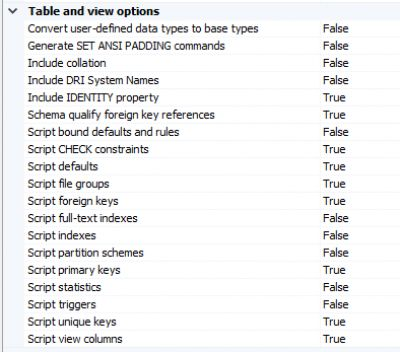

# SQL Management Studio

## SSMS Options

### Query window at Startup

1. Tools -> Options
2. Environment -> Startup
3. Select "Open Object Explorer and query window"

### Line Numbers

1. Tools -> Options
2. Text Editor -> Transact-SQL
3. General -> Settings
4. Check the box for "Line Numbers"

### Scroll Bar Map

1. Tools -> Options
2. Text Editor -> Transact-SQL
3. Scroll Bars -> Behavior
4. Click the radio dial for "Use Map..."
5. Check the box for "Show Preview Tooltip"

### Tabs In Own Row

1. Tools -> Options
2. Environment -> Tabs and Windows
3. Pinned Tabs
4. Check the box for "Show pinned tabs in a separate row"

### Table Scripting Options

1. Tools -> Options
2. SQL Server Object Explorer -> Scripting
3.   
    

### Tab Display Options

1. Tools -> Options
2. Text Editor -> Editor Tab and Status Bar

- 